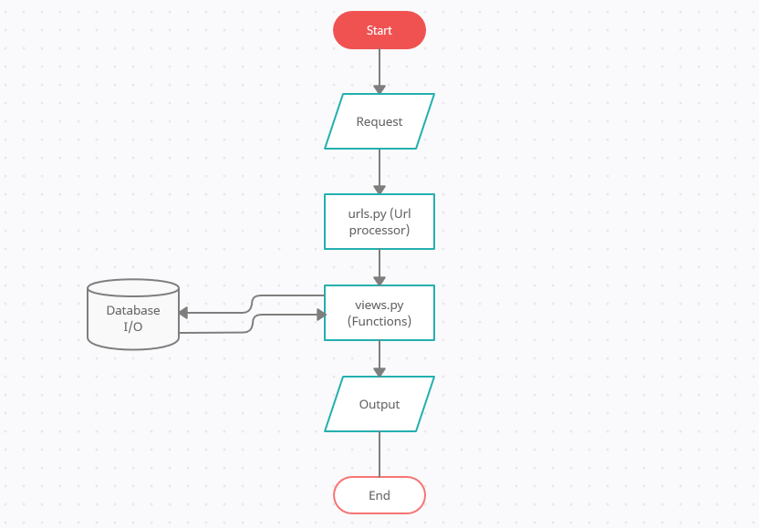

# THE HECK?.com
## A blogging website built using Django 3.1
### ‼ Ensure you create a folder called **'blogsite'** and place the contents of this repo into it before testing to avoid errors ‼

### Requirements to run this project:
* Django (this project was built on Django 3.1): [The Django Project](https://www.djangoproject.com/download/ "DJANGO is an awesome framework to design websites")

### What does this Website do❓
  As mentioned, this is a blogging website, it allows users to:
* Create a user account and login/logout at their convenience.
* Create and upload articles to the site.

### Features of the site:
* The site saves articles created by the user to its database, it can take a thumbnail, a title, a body and a custom slug.
  The slug is generated automatically using a JS script but can be modified to the user's will.
* The site can display the articles with the title, author's name and date of creation of the article.

### A walkthrough through the code
* The project has 3 apps: blogsite(the driver code), articles(the article management app) and accounts(the user management app)
* The project uses a single Model called Article (in the articles app ) using which it saves the details of the articles to the database.
* The project entirely uses Django's built in forms to get and save data from the user and to login, logout the user.
* The local html templates are located in the **'templates'** folder in the respective app folders and the global templates in the main folder. All the local templates extend from the main template **'baselayout.html'**.
* The media files and styling elements are located in the **'static'** folder.
* Basic workflow:

### Features to be added:
* Article Editing
* Custom backgrounds for each article
